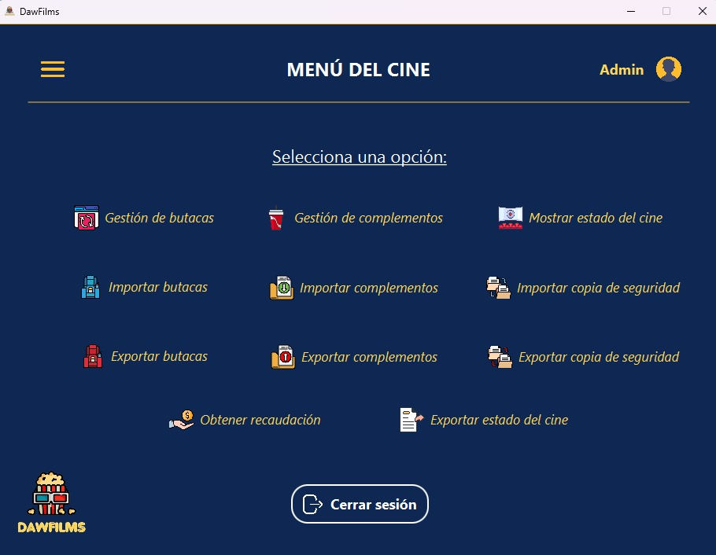
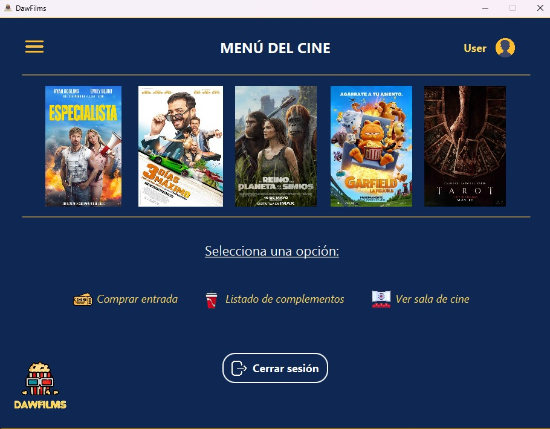

# Descripción del Programa

Hemos desarrollado una aplicación de cine con interfaces gráficas, implementando diferentes técnicas de programación para garantizar la integridad y robustez del sistema.

## Tecnologías y Enfoques Utilizados

* Arquitectura orientada al dominio.
* Uso de mónadas.
* Railway Oriented Programming (ROP).
* Manejo de errores orientados al dominio.

Además, hemos aplicado los principios SOLID para asegurar una estructura de código limpia y mantenible.

## Base de Datos

La aplicación utiliza SQLite como sistema de gestión de bases de datos, mediante la biblioteca SqlDelight.

## Importación y Exportación de Datos

Hemos implementado funcionalidades para la importación y exportación de datos en los siguientes formatos:
* CSV
* JSON
* XML
* HTML

## Lenguajes y Tecnologías

Los lenguajes y tecnologías utilizados en el desarrollo de la aplicación incluyen:
* Kotlin
* JavaFX
* SQLite
* SqlDelight
* HTML
* Mockito

## Calidad y Pruebas

Todo el programa ha sido revisado exhaustivamente con el objetivo de garantizar su correcto funcionamiento y liberar la aplicación de errores. Para ello, hemos implementado pruebas unitarias y hemos utilizado Mockito para los tests de integración.

## Autores del programa
* Jaime León
* Natalia González
* Alba García
* Javier Ruíz
* Germán Fernández

## Capturas de la aplicación

_Ilustración 1. Menú del administrador._

_Ilustración 2. Menú del cliente._

